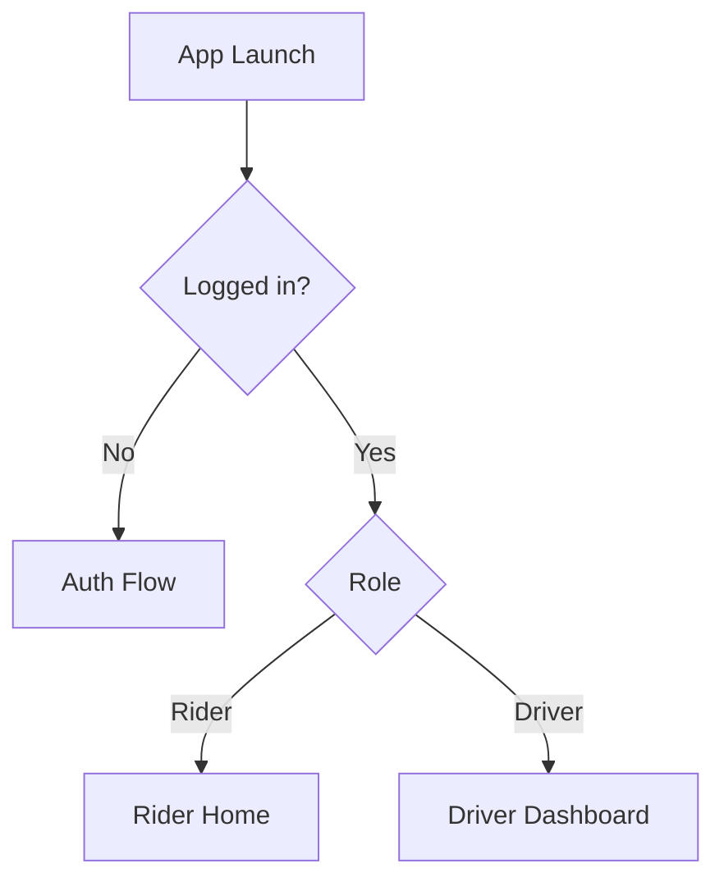
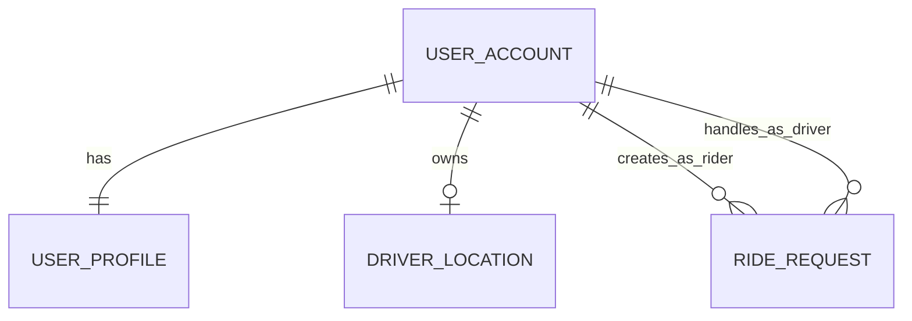
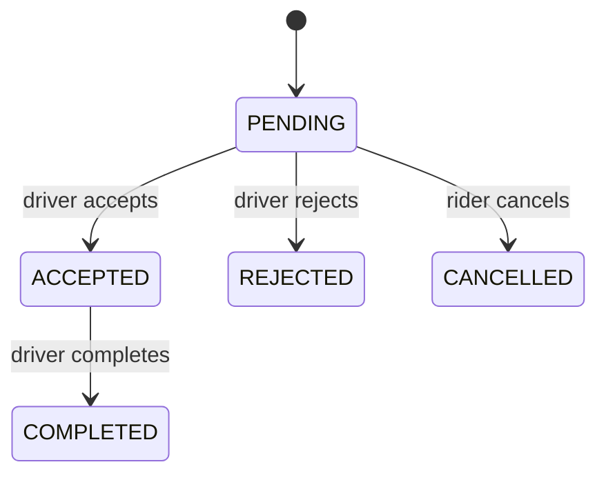

# HopMate App Flow and Diagram Blueprint

This document describes the current app behavior from code and provides diagram-ready content for:

- Use Case Diagram
- ER Diagram
- Flowcharts (Rider and Driver)
- Data Flow Diagram (Context + Level 1)

It is written so you can directly convert each section into visual diagrams.

## 1. System Scope

HopMate is a role-based ride-sharing app with two primary roles:

- Rider: discovers nearby drivers, requests rides, and manages profile/saved routes.
- Driver: goes online, shares live location, manages seat availability, and accepts/rejects/completes ride requests.

External services and platforms used:

- Appwrite Auth and Database (account, profile table, ride_requests, user_location)
- Geoapify (destination autocomplete and geocoding)
- Device location services (expo-location)
- Map rendering (react-native-maps)

## 2. Actors

Primary actors:

- Rider
- Driver

Supporting actors/systems:

- Appwrite Backend
- Geoapify API
- Device Location Service (OS)

## 3. Main Screens and Modules

Core navigation and shell:

- app/\_layout.tsx: root stack and UserMode provider
- app/index.tsx: auth + role gate and initial redirect
- app/(auth)/\*: onboarding, sign in, sign up, legal pages
- app/(root)/(tabs)/\_layout.tsx: role-aware tab visibility

Rider-facing features:

- app/(root)/(tabs)/home.tsx
- components/MapComponent.tsx
- components/CustomBottomSheet.tsx
- app/(root)/browse-drivers.tsx
- app/(root)/request-ride.tsx
- app/(root)/request-status.tsx
- app/(root)/(tabs)/saved.tsx
- app/(root)/(tabs)/rides.tsx

Driver-facing features:

- app/(root)/(tabs)/driver.tsx
- app/(root)/(tabs)/history.tsx
- components/LocationGate.tsx

Shared profile/auth context:

- contexts/UserModeContext.tsx
- app/(root)/(tabs)/profile.tsx
- lib/appwrite.ts

## 4. Use Case Diagram Content

### 4.1 Rider Use Cases

- Register account (choose Rider role)
- Sign in
- Maintain profile
- View nearby active drivers on map
- Search destination (Geoapify)
- Select driver
- Send ride request
- Monitor request status
- Cancel pending request
- View ride history (currently mock/static list in UI)
- Save destination route locally (current implementation is local state)
- Open saved destination and pass coordinates to Home

Relationships and notes:

- Send ride request includes: get current rider location
- Select driver depends on: destination selected and driver seat status not FULL
- Monitor request status extends to:
  - Accepted -> Ride confirmed state
  - Rejected -> Rejected state
  - Cancelled by rider -> Back to browsing

### 4.2 Driver Use Cases

- Register account (choose Driver role)
- Sign in
- Maintain profile
- Add/edit vehicle details
- Toggle online/offline status
- Toggle seat availability (AVAILABLE/FULL)
- Publish/update live location in backend
- Receive ride requests in real-time
- Accept request
- Reject request
- Complete accepted ride
- View completed ride history

Relationships and notes:

- Toggle seat availability depends on driver being online.
- Receive ride requests depends on matching DriverId in ride_requests.
- Complete ride transitions request status to COMPLETED.

### 4.3 Backend/System Use Cases

- Authenticate user and create session
- Read and update role/profile row
- Persist and stream driver location records
- Persist and stream ride request records
- Query completed rides for history

## 5. Flowchart Content

## 5.1 End-to-End Access Flow (Common)

1. App starts.
2. Root checks auth session and UserModeContext loads role from profile table.
3. Decision:
   - Not logged in -> onboarding/sign-in/sign-up flow.
   - Logged in + role RIDER -> Rider Home tab.
   - Logged in + role DRIVER -> Driver Home tab.

## 5.2 Rider Flow (Operational)

1. Rider opens Home.
2. App requests location permission and fetches current location.
3. Map loads active drivers from user_location and subscribes for updates.
4. Rider searches destination via Geoapify autocomplete.
5. Rider selects destination.
6. Driver list is shown (sorted by distance in browse view).
7. Rider chooses an available driver.
8. Rider chooses seats and submits request.
9. App creates ride_requests record with status PENDING.
10. Request status screen listens to document updates.
11. Decision:
    - If ACCEPTED -> show confirmed state.
    - If REJECTED -> show rejected state.
    - If rider cancels -> set CANCELLED and return to browsing.

## 5.3 Driver Flow (Operational)

1. Driver opens Driver tab.
2. LocationGate requests location permission.
3. Driver profile and existing vehicle/location document are loaded.
4. Decision:
   - Missing vehicle details -> show vehicle form until saved.
   - Vehicle details present -> show driver dashboard.
5. Driver toggles online/offline.
6. App upserts user_location record with coordinates, active state, and seat status.
7. Driver toggles seat status AVAILABLE/FULL as needed.
8. App updates seatStatus in user_location.
9. App listens to ride_requests stream filtered by DriverId.
10. Driver handles pending requests:
    - Accept -> status ACCEPTED and appears in Active Rides.
    - Reject -> status REJECTED and removed from queue.
11. Driver completes active ride -> status COMPLETED.
12. Completed rides appear in History screen (query + realtime updates).

## 5.4 Profile Management Flow (Both Roles)

1. User opens Profile tab.
2. App fetches profile row by UserID.
3. User edits fields (name, phone, username, about, DOB, gender).
4. App validates DOB format and age >= 18.
5. App updates profile row.
6. User can logout (delete sessions and redirect to sign-in).

## 6. ER Diagram Content

Use this section to draw an ER diagram for current persisted backend state.

### 6.1 Entities

## UserAccount (Appwrite Account)

Attributes:

- id (PK, Appwrite user id)
- email
- name
- auth/session metadata

## UserProfile (Table row)

Attributes:

- id (PK, row id; equals UserAccount.id in sign-up path)
- UserID (FK -> UserAccount.id)
- Role (RIDER | DRIVER)
- Name
- Email
- UserName
- PhoneNo
- Gender
- DateOfBirth
- AboutMe
- MemberSince

## DriverLocation (user_location collection document)

Attributes:

- id (PK, typically driver id)
- DriverId (FK -> UserAccount.id)
- DriverLatitude
- DriverLongitude
- seatStatus (AVAILABLE | FULL)
- isActive (boolean)
- VehicleType (AUTO | BIKE | SUV | SEDAN)
- VehicleModel
- PlateNumber
- DriverName (optional in code usage)

## RideRequest (ride_requests collection document)

Attributes:

- id (PK)
- RiderId (FK -> UserAccount.id)
- DriverId (FK -> UserAccount.id)
- RiderLat
- RiderLng
- DestinationName
- DestinationLat
- DestinationLng
- SeatsRequested
- Status (PENDING | ACCEPTED | REJECTED | CANCELLED | COMPLETED)
- createdAt/updatedAt

### 6.2 Relationships

- UserAccount 1 -- 1 UserProfile
- UserAccount 1 -- 0..1 DriverLocation (for users with Driver role)
- UserAccount (Rider) 1 -- \* RideRequest via RiderId
- UserAccount (Driver) 1 -- \* RideRequest via DriverId

### 6.3 Derived/Transient Data (Not Persisted in DB)

- Saved routes in Rider Saved tab are local component state currently.
- Rider ride history screen uses static mock array currently.
- Nearby driver list is computed in UI from DriverLocation documents + radius filtering.

## 7. Data Flow Diagram Content

## 7.1 Context Diagram (Level 0)

Single process:

- P0: HopMate Mobile App

External entities:

- E1 Rider
- E2 Driver
- E3 Appwrite Backend
- E4 Geoapify API
- E5 Device Location Service

Main data flows:

- Rider -> P0: auth credentials, destination query, ride request input, profile edits
- P0 -> Rider: map/driver list, request status, profile data
- Driver -> P0: auth credentials, availability toggles, request decisions, vehicle details
- P0 -> Driver: pending requests, active rides, history, profile data
- P0 <-> Appwrite: sessions, profile rows, location docs, ride request docs, realtime events
- P0 <-> Geoapify: autocomplete query and geocode result
- P0 <-> Device Location: permission state and GPS coordinates

## 7.2 Level 1 Processes

Processes:

- P1 Authentication and Role Routing
- P2 Rider Discovery and Requesting
- P3 Driver Availability and Fulfillment
- P4 Profile Management

Data stores:

- D1 UserProfile Store
- D2 DriverLocation Store
- D3 RideRequest Store

Detailed flows:

- P1 <-> Appwrite: create account/session, get account
- P1 <-> D1: read Role for mode selection

- Rider -> P2: destination + driver selection + seats
- P2 <-> Geoapify: place autocomplete/geocode
- P2 <-> Device Location: rider current coordinates
- P2 <-> D2: read active nearby drivers
- P2 -> D3: create ride request (PENDING)
- D3 -> P2: realtime status updates (ACCEPTED/REJECTED)

- Driver -> P3: online toggle, seat toggle, accept/reject/complete actions
- P3 <-> Device Location: driver coordinates
- P3 <-> D2: upsert active location + seat status + vehicle metadata
- P3 <-> D3: list/watch pending and accepted requests; update status

- User -> P4: profile edits
- P4 <-> D1: read/update profile fields
- P4 <-> Appwrite: logout/delete sessions

## 8. State Models for Diagramming

## 8.1 RideRequest State Machine

States:

- PENDING
- ACCEPTED
- REJECTED
- CANCELLED
- COMPLETED

Transitions:

- create request -> PENDING
- driver accept -> ACCEPTED
- driver reject -> REJECTED
- rider cancel (while pending) -> CANCELLED
- driver complete (after accepted) -> COMPLETED

## 8.2 Driver Availability State

States:

- Offline
- Online + SeatsAvailable
- Online + SeatsFull

Transitions:

- toggle online on -> Online + current seat status
- seat toggle -> switch between SeatsAvailable and SeatsFull
- toggle online off -> Offline

## 9. Diagram Components Checklist

Use this as a quick checklist before drawing.

For Use Case Diagram:

- Actors: Rider, Driver, Appwrite Backend, Geoapify API, Device Location Service
- Rider use cases: sign-up/sign-in, browse drivers, select destination, request ride, cancel request, manage profile, saved routes
- Driver use cases: set availability, manage vehicle, receive/handle request, complete ride, view history
- Include/extend links around request lifecycle

For ER Diagram:

- Entities: UserAccount, UserProfile, DriverLocation, RideRequest
- PK/FK links as listed
- Enum fields: Role, seatStatus, Status, VehicleType

For Rider Flowchart:

- start -> auth gate -> map + destination search -> select driver -> create request -> waiting -> accepted/rejected/cancel branches

For Driver Flowchart:

- start -> permission gate -> vehicle details check -> online toggle -> listen requests -> accept/reject -> complete ride -> history

For DFD:

- Context diagram with 1 process and 5 external entities
- Level 1 with P1-P4 and D1-D3 data stores
- Explicit read/write arrows for ride_requests and user_location

## 10. Practical Notes and Current Gaps

- Ride confirmed state in bottom sheet currently displays text only; no transition into ride-live screen from this flow.
- ride-live subscribes to user_location collection but rider coordinates are not currently persisted there from request flow.
- Rider Saved and Rider Rides are currently local/mock implementations, not persisted in backend collections.
- Driver location docs may not always include DriverName, so UI falls back to Unknown Driver.

These points can be represented in diagrams as "current implementation scope" and "future enhancement" notes.

## 11. Optional Mermaid Starters

You can paste these into Markdown renderers that support Mermaid.

